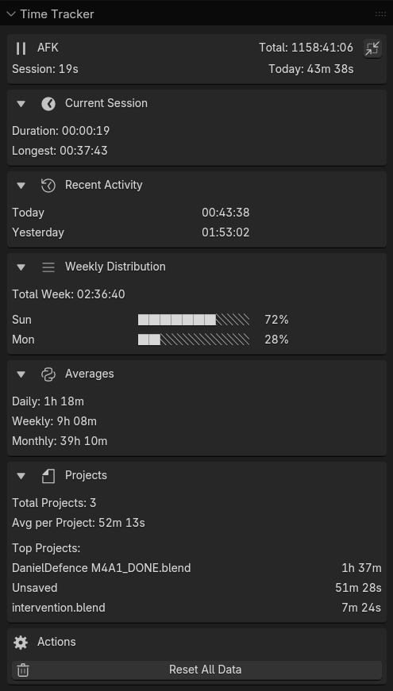

# BBTracker (Budloks Blender Tracker) - Blender Statistics Tracker
(BBTracker) Blender Statistics Tracker - Automatic productivity tracking for Blender with AFK detection, project analytics, and session monitoring.

# Blender Time Tracker

A comprehensive time tracking addon for Blender that helps you monitor your productivity and project time.

## Features

- **Automatic Time Tracking** - Tracks time spent in Blender automatically
- **AFK Detection** - Pauses tracking after 10 minutes of inactivity
- **Project-based Tracking** - Tracks time per .blend file
- **Weekly Analytics** - Visual breakdown of your weekly productivity
- **Compact & Detailed Views** - Toggle between minimal and detailed UI
- **Collapsible Sections** - Organize the UI to your preference
- **Session History** - Track current and longest sessions

## Installation

1. Download the latest release from [Releases](https://github.com/yourusername/blender-time-tracker/releases)
2. In Blender: Edit → Preferences → Add-ons → Install...
3. Select the downloaded `.zip` file
4. Enable "System: Blender Time Tracker"

## Usage

The addon automatically starts tracking when enabled. Find the panel in:
Properties Editor → Scene → Time Tracker

### Key Features:
- **Status Indicator**: Shows ACTIVE/AFK status
- **Quick Stats**: Always-visible overview of current session and totals
- **Weekly Distribution**: Visual breakdown of your week with percentages
- **Project Tracking**: Time spent per .blend file
- **Averages**: Daily, weekly, and monthly averages

## Data Storage

Your time tracking data is stored locally at:
`[Blender Config]/blender_time_tracker.json`

## Support

If you encounter any issues:
1. Check the [Issues](https://github.com/yourusername/blender-time-tracker/issues) page
2. Create a new issue with:
   - Blender version
   - Steps to reproduce
   - Error message (if any)

## License

MIT License - see [LICENSE](LICENSE) file for details.
